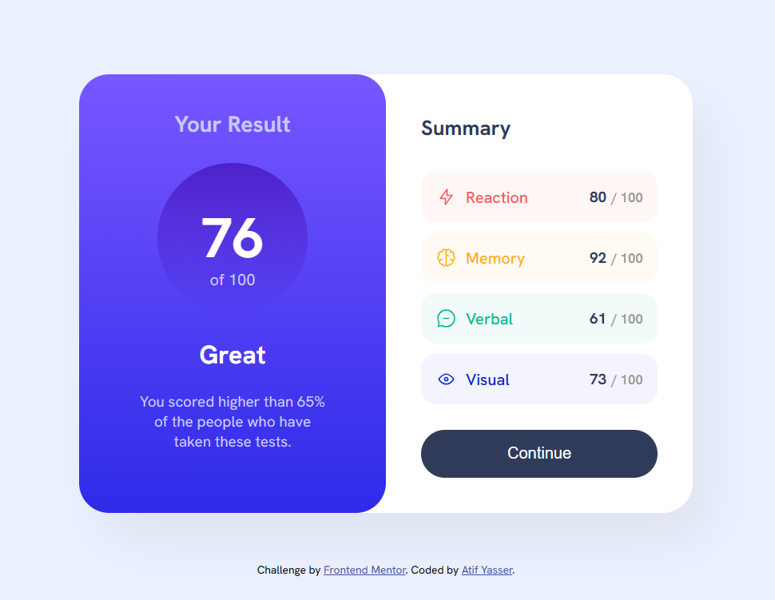
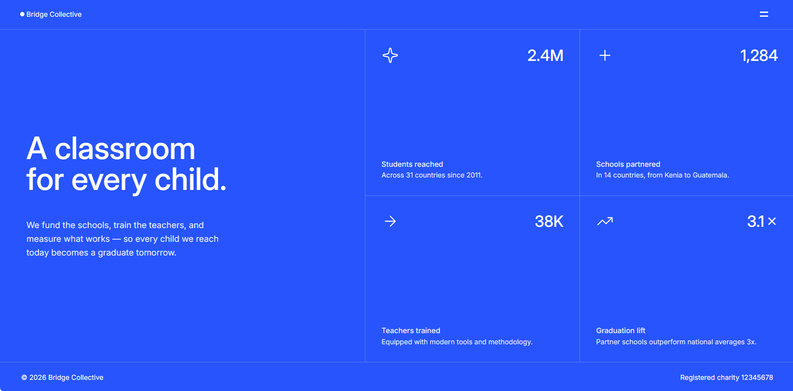

# Frontend Mentor Challenge Solutions

A collection of frontend projects built to practice and strengthen my skills through realistic, design-focused challenges and UI projects.

Most projects in this repository are solutions to [Frontend Mentor](https://www.frontendmentor.io/) challenges. Each project is built from a provided design and focuses on translating visual requirements into responsive, accessible, and interactive web interfaces.

The repository includes projects built with **HTML, CSS, JavaScript, and React**, ranging from simple responsive components to interactive applications with state management and dynamic data.

---

## 🚀 Projects

| Project                           | Preview                                                                                       | Technologies                 | Live Demo                                                                                                   | Source Code                                   | Challenge                                                                                     |
| --------------------------------- | --------------------------------------------------------------------------------------------- | ---------------------------- | ----------------------------------------------------------------------------------------------------------- | --------------------------------------------- | --------------------------------------------------------------------------------------------- |
| **Typing Speed Test**             |                                     | HTML, CSS, JavaScript        | [Live](https://atef7534.github.io/Frontend-Mentor-Challenges-Solutions/typing-speed-test-main/)             | [Code](./typing-speed-test-main/)             | [Challenge](https://www.frontendmentor.io/challenges/typing-speed-test)                       |
| **Social Links Profile**          |                               | HTML, CSS                    | [Live](https://atef7534.github.io/Frontend-Mentor-Challenges-Solutions/social-links-profile-main/)          | [Code](./social-links-profile-main/)          | [Challenge](https://www.frontendmentor.io/challenges/social-links-profile-ec5e2e9a6b)         |
| **QR Code Component**             |                                     | HTML, CSS                    | [Live](https://atef7534.github.io/Frontend-Mentor-Challenges-Solutions/qr-code-component-main/)             | [Code](./qr-code-component-main/)             | [Challenge](https://www.frontendmentor.io/challenges/qr-code-component-iux_sIO_H)             |
| **Blog Preview Card**             |                                     | HTML, CSS                    | [Live](https://atef7534.github.io/Frontend-Mentor-Challenges-Solutions/blog-preview-card-main/)             | [Code](./blog-preview-card-main/)             | [Challenge](https://www.frontendmentor.io/challenges/blog-preview-card-HJ_0pTmQG)             |
| **Order Summary Component**       |                         | HTML, CSS                    | [Live](https://atef7534.github.io/Frontend-Mentor-Challenges-Solutions/order-summary-component-main/)       | [Code](./order-summary-component-main/)       | [Challenge](https://www.frontendmentor.io/challenges/order-summary-component-QlPmajDUj)       |
| **Results Summary Component**     |                  | HTML, CSS                    | [Live](https://atef7534.github.io/Frontend-Mentor-Challenges-Solutions/results-summary-component-main/)     | [Code](./results-summary-component-main/)     | [Challenge](https://www.frontendmentor.io/challenges/results-summary-component-CE_K6s0maV)    |
| **Grid Landing Page**             |  | HTML, CSS, JavaScript        | [Live](https://atef7534.github.io/Frontend-Mentor-Challenges-Solutions/grid-landing-page-main/)             | [Code](./grid-landing-page-main/)             | —                                                                                             |
| **Flash Cards**                   | —                                                                                             | HTML, CSS, JavaScript        | [Live](https://atef7534.github.io/Frontend-Mentor-Challenges-Solutions/flash-card-main/)                    | [Code](./flash-card-main/)                    | Practice Project                                                                              |

> **Note:** Not every project in this repository is a Frontend Mentor challenge. Some projects are independent practice projects created to explore specific frontend concepts.

---

## 📚 About the Repository

The purpose of this repository is to document my progress as I develop my frontend skills and to keep my projects organized in one place.

The projects gradually increase in complexity:

* Building static interfaces from designs
* Creating responsive layouts
* Working with Flexbox and CSS Grid
* Adding JavaScript interactions
* Managing dynamic data
* Building reusable React components
* Managing component state
* Implementing filtering and conditional rendering
* Working with browser APIs and `localStorage`

As I continue learning, I will add new projects and revisit previous implementations to improve their structure, responsiveness, accessibility, and maintainability.

---

## 🎯 Current Focus

My current frontend practice focuses on:

* Semantic HTML
* Responsive web design
* CSS Flexbox
* CSS Grid
* CSS custom properties
* JavaScript fundamentals
* DOM manipulation
* Event handling
* Array methods such as `map()` and `filter()`
* Working with JSON data
* Browser `localStorage`
* Fetching data from APIs
* React components
* React props
* React state with `useState`
* State updates and event handling
* Conditional rendering
* Component-based architecture
* Accessibility and keyboard interaction
* Building responsive interfaces from designs

---

## 🛠️ Technologies

### Core Technologies

* HTML5
* CSS3
* JavaScript (ES6+)
* React
* Vite

### CSS & Layout

* Flexbox
* CSS Grid
* Media Queries
* CSS Custom Properties
* Responsive Design
* CSS Transitions
* Hover & Focus States

### JavaScript

* DOM Manipulation
* Event Listeners
* Array Methods
* Timers
* Fetch API
* JSON Data
* `localStorage`

### React

* Functional Components
* JSX
* Props
* `useState`
* `useEffect`
* Event Handling
* Conditional Rendering
* List Rendering
* Component Composition

The exact technologies used by each project are listed in the project table and in the individual project README files.

---

## 💡 Featured Projects

### ⌨️ Typing Speed Test

The Typing Speed Test is one of the most interactive vanilla JavaScript projects in the repository.

It includes:

* Easy, Medium, and Hard difficulty levels
* 60-second timed mode
* Passage mode
* Random passage selection from `data.json`
* Real-time WPM calculation
* Real-time accuracy calculation
* Correct and incorrect character feedback
* Backspace support
* Restart functionality
* Personal best score
* `localStorage` persistence
* JavaScript timers
* DOM manipulation
* Responsive layouts

[View Project](./typing-speed-test-main/) · [Live Demo](https://atef7534.github.io/Frontend-Mentor-Challenges-Solutions/typing-speed-test-main/)

---

### 🧩 Browser Extensions Manager UI

The Browser Extensions Manager UI is the current React project in this collection.

It was built as a solution to the [Frontend Mentor Browser Extensions Manager UI challenge](https://www.frontendmentor.io/challenges/browser-extension-manager-ui-yNZnOfsMAp).

The project uses **React + Vite** and works with the provided local `data.json` file.

#### Features

* Dark and light themes
* Dynamic extension cards
* Active/inactive extension states
* Filter by:

  * All
  * Active
  * Inactive
* Remove extensions
* Responsive extension grid
* Reusable React components
* React state management
* Dynamic rendering from JSON data
* Keyboard focus states
* Responsive design

The project is structured around reusable components such as the extension header/theme control and extension list.

[View Project](./browser-extensions-manager-ui-main/) · [Live Demo](https://atef7534.github.io/Frontend-Mentor-Challenges-Solutions/browser-extensions-manager-ui-main/)

---

### 🧱 Grid Landing Page

A responsive landing page created to practice more advanced CSS layouts.

The project includes:

* CSS Grid-based desktop layout
* Responsive mobile layout
* Statistics grid
* Interactive navigation panel
* Sliding navigation animation
* Background overlay
* Hover states
* Responsive typography
* JavaScript DOM manipulation

[View Project](./grid-landing-page-main/) · [Live Demo](https://atef7534.github.io/Frontend-Mentor-Challenges-Solutions/grid-landing-page-main/)

---

### 🃏 Flash Cards

A frontend practice project focused on building a flash-card style interface.

The current implementation includes:

* Study mode and all-cards mode
* Category dropdown
* Category selection
* Hide mastered control
* Shuffle control UI
* Study statistics
* Responsive interface
* JavaScript event handling
* Custom dropdown implementation

This project is currently a UI/interaction practice project rather than a full flash-card application.

[View Project](./flash-card-main/) · [Live Demo](https://atef7534.github.io/Frontend-Mentor-Challenges-Solutions/flash-card-main/)

---

## 🧠 What I'm Learning

Working through these projects helps me practice turning a static design into a functional interface.

Some of the main skills I'm developing are:

1. Translating designs into semantic HTML.
2. Building responsive layouts from desktop and mobile references.
3. Using Flexbox and CSS Grid appropriately.
4. Creating reusable CSS patterns.
5. Working with JavaScript and the DOM.
6. Handling user interactions and events.
7. Working with arrays and dynamic data.
8. Organizing JavaScript into smaller functions.
9. Managing state in React.
10. Passing data through React props.
11. Rendering lists dynamically.
12. Filtering and updating application data.
13. Building reusable React components.
14. Debugging frontend issues.
15. Improving accessibility and keyboard interaction.
16. Writing cleaner and more maintainable code.

---

## 📂 Repository Structure

```text
Frontend-Mentor-Challenges-Solutions/
│
├── browser-extensions-manager-ui-main/
│   ├── src/
│   ├── public/
│   ├── data.json
│   ├── package.json
│   └── README.md
│
├── blog-preview-card-main/
│
├── flash-card-main/
│
├── grid-landing-page-main/
│
├── order-summary-component-main/
│
├── qr-code-component-main/
│
├── results-summary-component-main/
│
├── social-links-profile-main/
│
├── typing-speed-test-main/
│
└── README.md
```

Each project is kept as a self-contained folder and may contain:

* HTML files
* CSS files
* JavaScript files
* React components
* JSON data
* Images and other assets
* Design references
* Fonts
* Style guides
* Project-specific README files

---

## ⚛️ React Projects

The repository is gradually moving beyond static HTML/CSS implementations into component-based React development.

The **Browser Extensions Manager UI** is currently the main React project.

It uses:

* React
* JSX
* Vite
* Functional components
* `useState`
* `useEffect`
* Props
* Conditional rendering
* List rendering
* Event handlers
* Local JSON data

The project helped me practice managing UI state and splitting an interface into smaller reusable components.

---

## 🤖 AI Collaboration

I sometimes use AI tools such as ChatGPT as development assistants while working on these projects.

AI may be used for:

* Debugging and troubleshooting
* Explaining unfamiliar JavaScript or React concepts
* Reviewing code organization
* Understanding errors
* Discussing alternative implementation strategies
* Exploring better approaches to a problem
* Improving accessibility and code quality

The goal is to use AI as a learning and development assistant rather than simply copying generated solutions.

The code is reviewed, adapted, tested, and understood as part of my own development process.

---

## 📈 Learning Progress

This repository represents my progression from basic frontend layouts toward more interactive and component-based applications.

### Stage 1 — HTML & CSS

Started with small component-based interfaces:

* Social Links Profile
* QR Code Component
* Blog Preview Card
* Order Summary Component
* Results Summary Component

### Stage 2 — JavaScript

Moved into interactive applications:

* Typing Speed Test
* Flash Cards
* Grid Landing Page

### Stage 3 — React

Started building interfaces with reusable components and state management:

* Browser Extensions Manager UI

More React projects will be added as I continue developing my React skills.

---

## 🔗 Useful Links

* [Frontend Mentor](https://www.frontendmentor.io/)
* [My Frontend Mentor Profile](https://www.frontendmentor.io/profile/atef7534)
* [My GitHub Profile](https://github.com/atef7534)
* [This Repository](https://github.com/atef7534/Frontend-Mentor-Challenges-Solutions)

---

## 👨‍💻 Author

**Atif Yasser**

* GitHub: [@atef7534](https://github.com/atef7534)
* Frontend Mentor: [@atef7534](https://www.frontendmentor.io/profile/atef7534)

---

Built while practicing frontend development, learning JavaScript and React, and working through design-focused projects. 🚀
