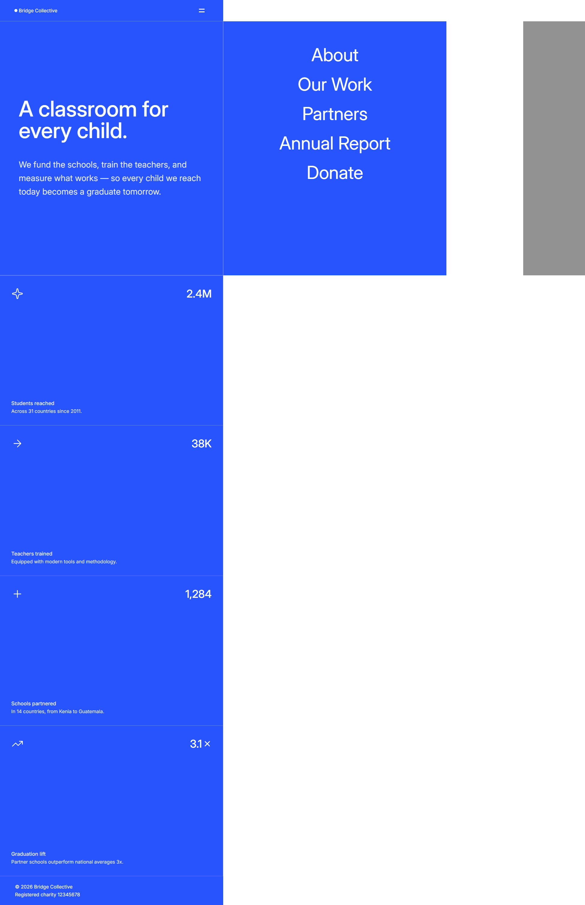

# Frontend Mentor - Grid Landing Page


A responsive landing page built as a solution to a Frontend Mentor challenge.

The project focuses on creating a clean, grid-based layout with responsive behavior, an interactive navigation menu, hover states, and different layouts for desktop and mobile screen sizes.

## 🚀 Live Demo

[View the live project](https://atef7534.github.io/Frontend-Mentor-Challenges-Solutions/grid-landing-page-main/)

## 📂 Repository

[View the source code](https://github.com/atef7534/Frontend-Mentor-Challenges-Solutions/tree/main/grid-landing-page-main)

## 🎯 The Challenge

The goal was to build a landing page for a fictional education nonprofit called **Bridge Collective** and make the implementation as close as possible to the provided design.

The page contains:

- A responsive navigation header
- A hero section with a headline and description
- A 2×2 grid of impact statistics
- Interactive hover states
- A slide-in navigation panel
- A background overlay when the navigation is open
- A responsive mobile layout
- A footer section

The project was built from scratch using the provided design as a reference.

## 🛠️ Technologies Used

- HTML5
- CSS3
- JavaScript (ES6+)
- CSS Grid
- Flexbox
- CSS Media Queries
- DOM Manipulation
- Google Fonts — Inter

## 📱 Responsive Design

The layout adapts to different screen sizes.

### Desktop

The main content is divided into three columns:

```text
┌──────────────────┬──────────────┬──────────────┐
│                  │              │              │
│                  │    Stat 1    │    Stat 3    │
│   Hero Content   │              │              │
│                  ├──────────────┼──────────────┤
│                  │    Stat 2    │    Stat 4    │
│                  │              │              │
└──────────────────┴──────────────┴──────────────┘
```

### Mobile

The layout switches to a single-column structure, with the hero section followed by the statistics cards.

The CSS uses a breakpoint at **767px** to adapt the layout for smaller screens.

## 🍔 Interactive Navigation

The navigation menu is implemented using JavaScript.

Clicking the menu icon toggles the `active` class on:

- `.panel-links`
- `.overlay`

This causes the navigation panel to slide into the viewport using a CSS transform and transition.

The menu contains:

- About
- Our Work
- Partners
- Annual Report
- Donate

## 🎨 Styling

The project uses **Inter** as its primary font and a blue-based visual design.

Some of the main styling techniques used include:

- CSS Grid for the main page structure
- Flexbox for alignment and component layouts
- CSS transitions for the navigation animation
- Media queries for responsive layouts
- Hover states for statistic cards
- CSS pseudo-elements for decorative elements
- CSS custom sizing and spacing to reproduce the provided design

The main layout is implemented with CSS Grid, while the statistic cards use Flexbox internally.

## 🧠 What I Practiced

This project helped me practice several frontend development concepts:

### CSS Grid

I used CSS Grid to create the three-column desktop layout and switch to a single-column layout on mobile devices.

### Responsive Design

I practiced adapting the layout, typography, spacing, navigation, and statistic cards for smaller screens.

### Flexbox

Flexbox was used for:

- Header alignment
- Statistic card layouts
- Hero content alignment
- Footer alignment
- Navigation elements

### JavaScript DOM Manipulation

JavaScript was used to select DOM elements and toggle classes when the navigation icon is clicked.

The implementation keeps the interaction simple by using the `active` class to control the visual state.

### CSS Transitions

The navigation panel uses `transform: translateX()` together with a transition to create the sliding menu effect.

## 📁 Project Structure

```text
grid-landing-page-main/
│
├── assets/
│   └── images/
│
├── screenshots/
│   ├── desktop-size-bridge-collective.png
│   └── ...
│
├── .gitignore
├── index.html
├── main.css
├── main.js
├── README-template.md
└── README.md
```

### Main Files

**`index.html`**

Contains the semantic structure of the landing page, including the header, navigation, hero section, statistics, and footer.

**`main.css`**

Contains the complete styling, responsive layouts, grid structure, animations, hover states, and mobile adaptations.

**`main.js`**

Controls the opening and closing of the navigation panel and its overlay.

## 🔍 Key Features

- ✅ Responsive desktop layout
- ✅ Responsive mobile layout
- ✅ CSS Grid-based structure
- ✅ Flexbox layouts
- ✅ Interactive navigation menu
- ✅ Sliding navigation animation
- ✅ Background overlay
- ✅ Hover effects
- ✅ Responsive typography
- ✅ Inter font
- ✅ Semantic HTML structure
- ✅ Mobile-first considerations

## 📸 Screenshots

### Desktop


### Mobile



## 🤖 AI Collaboration

I sometimes use AI tools such as ChatGPT as a development assistant while working on my projects.

AI may be used for:

- Debugging and troubleshooting
- Explaining unfamiliar concepts
- Reviewing code
- Discussing alternative implementation approaches
- Improving code organization

The final implementation is reviewed, adapted, and tested as part of my own development process.

## 🔗 Links

- [Frontend Mentor](https://www.frontendmentor.io/)
- [My GitHub Profile](https://github.com/atef7534)
- [Repository](https://github.com/atef7534/Frontend-Mentor-Challenges-Solutions)
- [Live Project](https://atef7534.github.io/Frontend-Mentor-Challenges-Solutions/grid-landing-page-main/)

## 👨‍💻 Author

**Atif Yasser**

- GitHub: [@atef7534](https://github.com/atef7534)
- Frontend Mentor: [@atef7534](https://www.frontendmentor.io/profile/atef7534)

---

Built as part of my frontend development practice with [Frontend Mentor](https://www.frontendmentor.io/). 🚀
