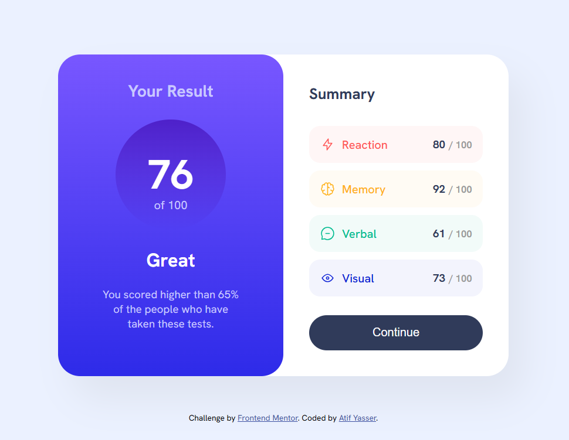

# Frontend Mentor - Results summary component solution

This is a solution to the [Results summary component challenge on Frontend Mentor](https://www.frontendmentor.io/challenges/results-summary-component-CE_K6s0maV). Frontend Mentor challenges help you improve your coding skills by building realistic projects.

## Table of contents

- [The challenge](#the-challenge)
- [Screenshot](#screenshot)
- [Links](#links)
- [Built with](#built-with)
- [Continued development](#continued-development)
- [Author](#author)

### The challenge

Users should be able to:

- View the optimal layout for the interface depending on their device's screen size
- See hover and focus states for all interactive elements on the page

### Screenshot

### Links

- Solution URL: [See code](https://github.com/atef7534/Frontend-Mentor-Challenges-Solutions/tree/main/results-summary-component-main)
- Live Site URL: [Results summary](https://atef7534.github.io/Frontend-Mentor-Challenges-Solutions/results-summary-component-main/)

### Built with

- Semantic HTML5 markup
- CSS custom properties
- Flexbox
- Mobile-first workflow

### Continued development

Use this section to outline areas that you want to continue focusing on in future projects. These could be concepts you're still not completely comfortable with or techniques you found useful that you want to refine and perfect.

## Author

- Frontend Mentor - [@atef7534](https://www.frontendmentor.io/profile/atef7534)

## FURTHER HELP 😃

- IF YOU HAVE ANY NEW ADJUSTMENTS FOR THE DESIGN, FEEL FREE TO TELL ME AS THIS WILL HELP ME A LOT TO GET THE BEST VERSION OF EACH PROJECT BUILT BY MYSELF. HAVE A GOOD DAY 😊
